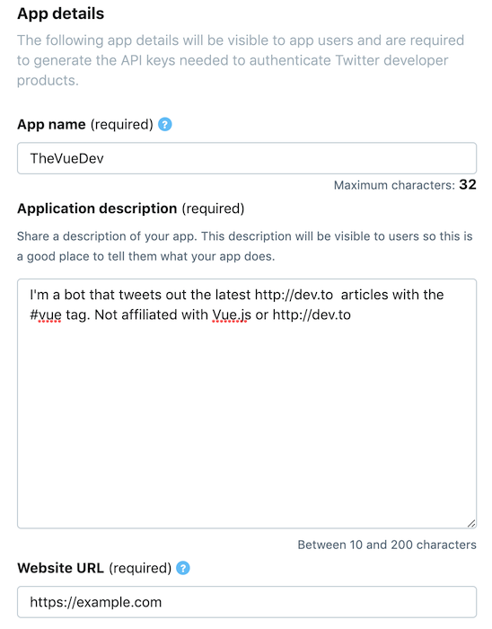
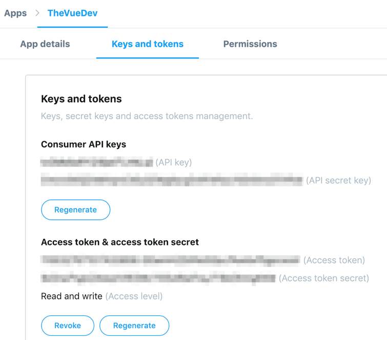
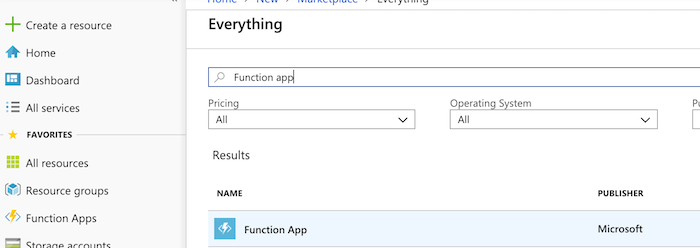
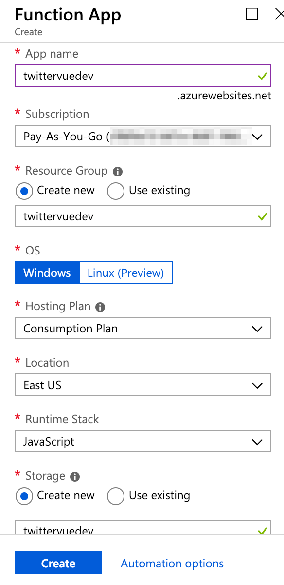
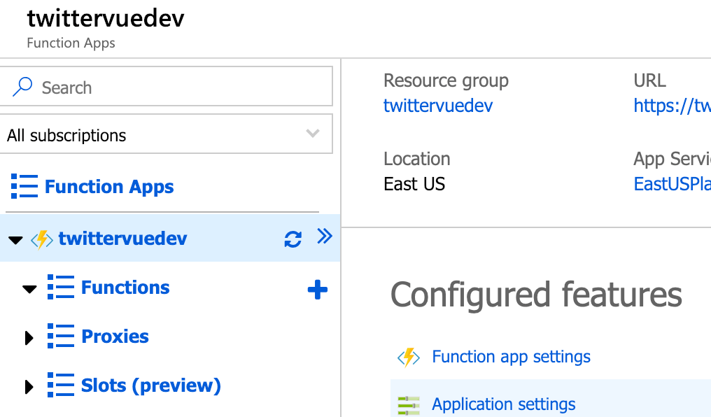
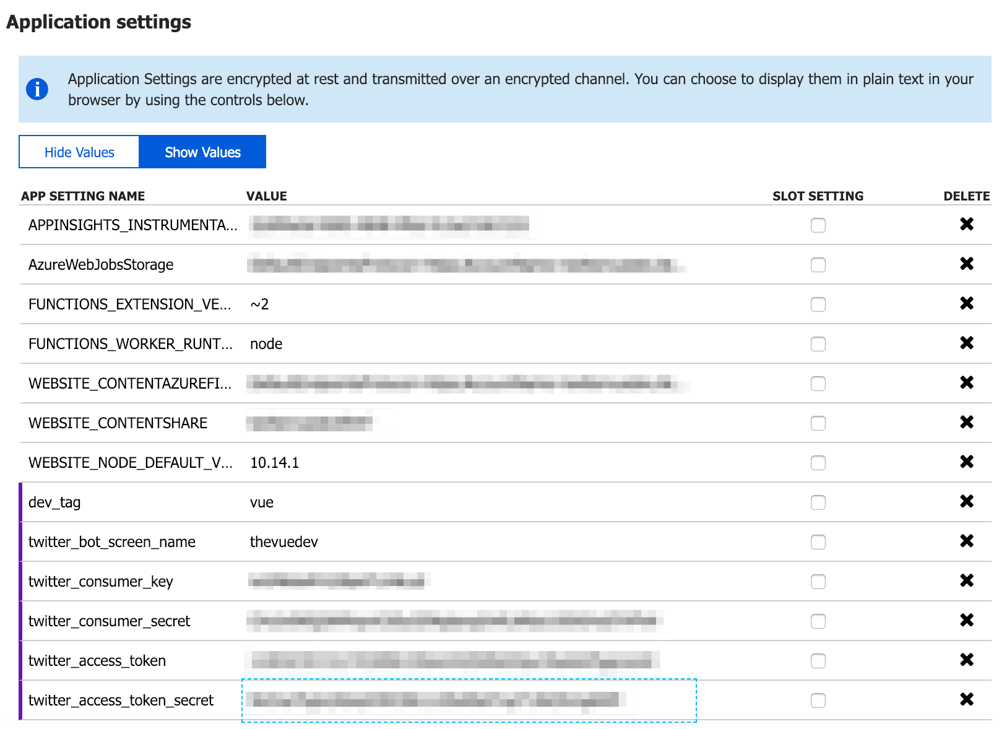
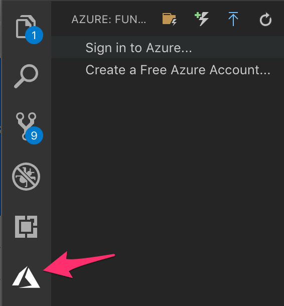
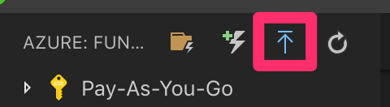

# twitter-vue-dev

A bot that lives in Azure Functions and tweets all [dev.to](https://dev.to) VueJS articles. Find it [@TheVueDev](https://twitter.com/TheVueDev).

This same code can be used to create a Twitter bot that tweets new articles from any valid [dev.to](https://dev.to) tag.

## Deployment

Follow these instructions to create your own Twitter bot that tweets [dev.to](https://dev.to) articles for the tag of your choice. It will probably cost you a few cents a month in Azure Storage fees.

### Setup Twitter account

1. Go to [twitter.com](https://twitter.com) and make a Twitter account for your bot.
1. While signed into your bot's Twitter account, go to [developer.twitter.com](https://developer.twitter.com), click "Apply", and then follow the prompts to apply for a developer account.
   - When asked to "Select a user profile to associate", ensure your bot's account is selected.
   - Fill in the requested information about what your developer account will be used for, accept the terms and conditions, and answer any other questions.
1. Once you have completed the process to create a developer account, click "Create an app".
1. Give it a name and description. The URL is irrelevant - you can enter https://example.com. - No need to "Enable Sign in with Twitter" or enter Callback URLs, other URLs, or Organization details. - You will however need to enter some details about how the app will be used.

   

1. After creating the app, click "Keys and tokens", and under "Access token & access token secret" click "Create" to generate an access token that will enable you to tweet to the account using Twitter's APIs. Keep this page open in a tab - you'll need all for keys and secrets later!

   

### Setup Azure Function

1. Go to [portal.azure.com](https://portal.azure.com) and sign in/sign up. You will need a subscription, so create one if you haven't yet got one.
1. In the Azure Portal, click "Create a resource", and create a new "Function App".
   
1. Fill in the details of your Function App. - Make sure you set the `Runtime Stack` option to **JavaScript** - this isn't easy to change later.

   - You'll need to create a Storage account where Azure will store some files relating to the function. This may cost you a few cents each month.
   - If you wish you can set up an Application Insights application to monitor the function.
   

1. Wait for the function app to deploy, then navigate to it in the Azure Portal and click `Application Settings`.
   
1. Under "Application Settings", add the following new settings to set environment variables that the function code can use:
   - `dev_tag`: The exact valid dev.to tag that you want the bot to tweet articles for. Leave out the #.
   - `twitter_bot_screen_name`: The Twitter handle of your bot. Leave out the @.
   - `twitter_consumer_key`: The Consumer API Key from the Twitter app.
   - `twitter_consumer_secret`: The API Secret Key from the Twitter app.
   - `twitter_access_token`: The Access Token from the Twitter app.
   - `twitter_access_token_secret`: The Access Token Secret from the Twitter app.
      

### Get code and deploy!

1. Ensure you have [Node 8.0+](https://nodejs.org), [Visual Studio Code](https://code.visualstudio.com/), and the [Typescript](https://www.typescriptlang.org/) compiler installed on your dev machine.
1. Install the [Azure Functions extension](https://marketplace.visualstudio.com/items?itemName=ms-azuretools.vscode-azurefunctions) in Visual Studio Code.
1. Clone or download this repository and run `npm install` from the root directory to install node modules.
1. Run `tsc` from the root directory to compile Typescript.
1. Open the project in Visual Studio Code, and click on the new Azure icon in the left. Click "Sign in to Azure" and follow the prompts to sign in.

   

1. Click the correct button in the Visual Studio Code extension to deploy the Function app, and follow the prompts to select the function app you created earlier.

   

1. Check the Twitter Account and see if it's Tweeting!
